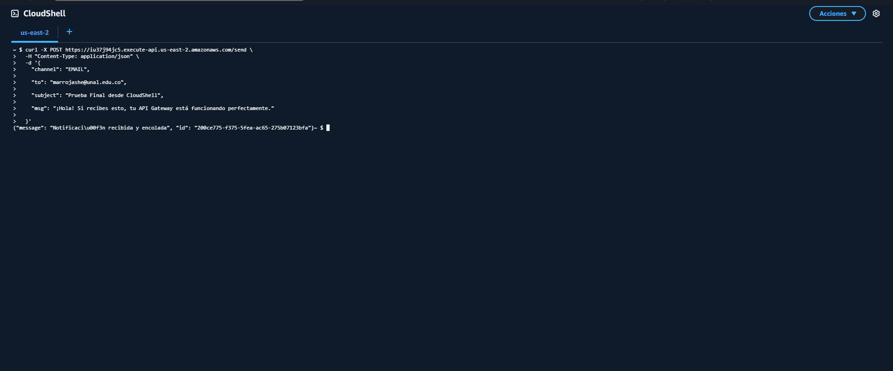
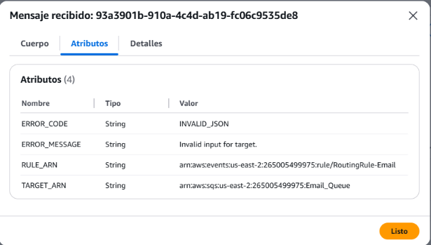
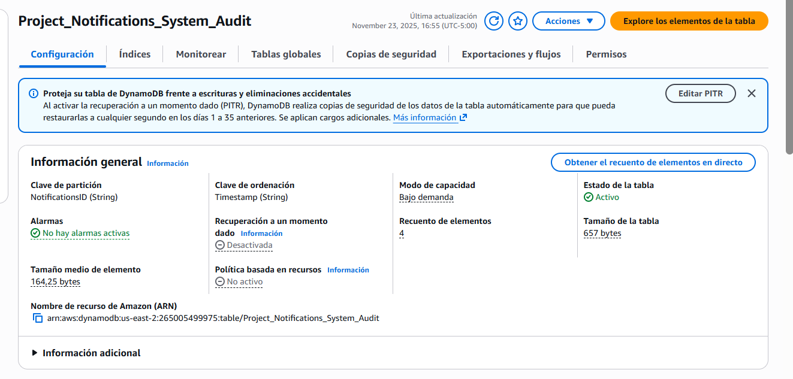
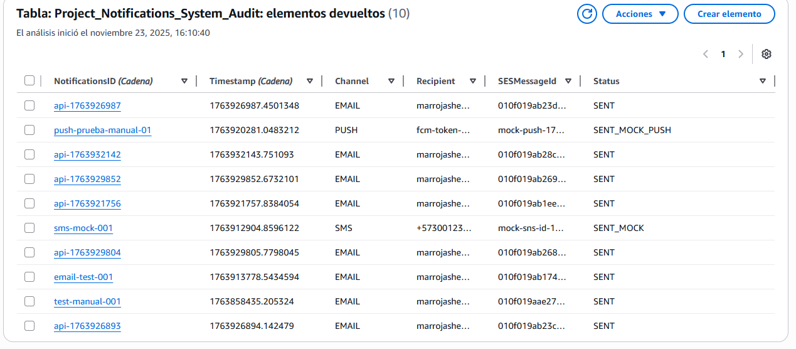

# Bitácora Técnica: Sistema de Notificaciones Multi-Canal (Event-Driven Architecture)

**Autores:** María Camila Rojas Herrera Sebastián Sierra Rivera
**Fecha de Inicio:** Noviembre 2025  
**Región Principal (Lógica):** `us-east-2` (Ohio)  
**Región Secundaria (Facturación):** `us-east-1` (N. Virginia)

---

## 1. Fase de Gobierno y Control de Costos (Capa 0)

Antes de desplegar la infraestructura de la aplicación, se implementaron controles de seguridad financiera y acceso para garantizar la sostenibilidad del proyecto en la capa gratuita de AWS.

### 1.1. Alarma de Facturación (FinOps)
Se configuró una alarma en **Amazon CloudWatch** para monitorear proactivamente los costos estimados de la cuenta.

* **Métrica:** `EstimatedCharges` (Moneda: USD).
* **Umbral:** ≥ $15.00 USD.
* **Acción:** Notificación inmediata vía Amazon SNS al correo electrónico del administrador.
* **Estado:** Suscripción confirmada.

> **Evidencia de Configuración:**
> Creación de la suscripción al tema SNS `AlarmaPresupuesto20USD`.

### 1.2. Gestión de Identidad (IAM)
Se estableció un esquema de colaboración seguro utilizando el principio de mínimo privilegio.

* **Grupo IAM:** `Desarrolladores-Notificaciones-EDA`.
* **Políticas Adjuntas:** Acceso limitado a los servicios SQS, Lambda, DynamoDB y SES necesarios para el desarrollo.
* **Usuarios:** Creación de usuarios IAM individuales para evitar el uso de la cuenta raíz.

---

## 2. Capa 1: Ingestión Pública (El Frontend & API)

Se implementó la capa de entrada pública para exponer el sistema como un microservicio accesible vía HTTP.

### 2.1. Componentes de Ingestión
* **Amazon API Gateway (HTTP API):** Expone el endpoint `POST /send` y `GET /`.
* **Lambda Producer (`ProducerLambda`):**
    * **Rol IAM:** `ProducerRole` con permiso `events:PutEvents` restringido al bus `default`.
    * **Lógica:** Implementa un patrón dual (API Backend + Web Frontend).

### 2.2. Interfaz Gráfica Embebida (Serverless Frontend)
Se desarrolló una **Single Page Application (SPA)** ligera servida directamente desde la Lambda mediante el método `GET`. Esto elimina la necesidad de hosting adicional (S3/CloudFront) para pruebas simples.

> **Evidencia Final:** Interfaz web del proyecto funcionando y lista para enviar notificaciones a los 3 canales.
>
> 

### 2.3. Prueba de Sistema (End-to-End)
Se realizaron pruebas de envío desde la interfaz web y mediante comandos `cURL` en CloudShell, validando que el payload JSON se inyecta correctamente en EventBridge.

> **Evidencia:** Respuesta JSON exitosa del API Gateway (`200 OK`).
>
> 

---

## 3. Capa 2: Enrutamiento y Resiliencia (Buffer)

Se construyó la infraestructura de mensajería asíncrona para desacoplar los componentes y manejar picos de carga.

### 3.1. Colas SQS (Buffers)
Se aprovisionaron 4 colas estándar en la región `us-east-2`. Cada canal cuenta con su propia cola dedicada para garantizar aislamiento de fallos.

1.  **`Email_Queue`:** Buffer para notificaciones de correo electrónico.
2.  **`SMSQueue`:** Buffer para mensajes de texto.
3.  **`PushQueue`:** Buffer para notificaciones push móviles.
4.  **`NotificacionesDLQ`:** Dead Letter Queue centralizada.

* **Configuración de Resiliencia:** Se configuró una *Redrive Policy* en las tres colas principales con `Maximum Receives = 3`. Si un mensaje falla 3 veces, se mueve automáticamente a la DLQ para análisis forense.

### 3.2. Seguridad de Colas (Hardening) - **Reto Crítico**
Durante la integración, se enfrentaron problemas de permisos que impedían a EventBridge escribir en SQS.

* **Error Detectado:** EventBridge reportaba éxito, pero los mensajes no llegaban a la cola ni a la Lambda.
* **Causa Raíz 1 (Encriptación):** El cifrado predeterminado `SSE-KMS` bloqueaba a EventBridge porque este servicio no tenía permisos sobre la llave KMS.
    * **Solución:** Se cambió el cifrado a **`SSE-SQS`**, que es transparente para los servicios de AWS.
* **Causa Raíz 2 (Identidad):** La regla de EventBridge estaba configurada para usar un Rol IAM de Lambda (`EmailConsumerRole`), lo cual generaba un conflicto de identidad.
    * **Solución:** Se eliminó el rol de la regla y se delegó la autorización a la **Política de Acceso de la Cola**.

> **Evidencia Técnica:** Política de acceso JSON final configurada en la cola `Email_Queue`, permitiendo explícitamente al servicio `events.amazonaws.com` bajo la condición del ARN de la regla.
>
> 

### 3.3. Diagnóstico de Errores de Formato (`INVALID_JSON`)
Incluso con los permisos corregidos, los mensajes terminaban en la DLQ.

* **Evidencia Forense:** Al inspeccionar un mensaje en la DLQ, se encontró el atributo `ERROR_CODE: INVALID_JSON`.
* **Solución:** Se reconfiguró el *Input Transformer* de EventBridge para construir manualmente un objeto JSON válido en lugar de pasar el evento crudo.

> **Evidencia:** Mensaje capturado en la DLQ mostrando el error de formato.
>
> 

---

## 4. Capa 3: Consumo y Persistencia (Backend)

Se implementó la lógica de negocio mediante funciones Serverless y una base de datos NoSQL para auditoría.

### 4.1. Base de Datos de Auditoría (DynamoDB)
Se creó la tabla `Project_Notifications_System_Audit` para registrar el estado de cada notificación.

* **Modelo de Datos:**
    * **PK (Partition Key):** `NotificationsID` (String) - ID único del mensaje.
    * **SK (Sort Key):** `Timestamp` (String) - Marca de tiempo Unix.
* **Analítica en Tiempo Real:** Se habilitó **DynamoDB Streams** con la configuración `New Image` para permitir que futuros consumidores analíticos reaccionen a cada inserción.

> **Evidencia:** Tabla DynamoDB activa en la región Ohio con Streams habilitados.
>
> 

### 4.2. Canal Email (Implementación Real)
Se configuró el flujo completo para el envío de correos electrónicos transaccionales.

* **Proveedor:** Amazon SES (Simple Email Service).
* **Identidad:** Se verificó la dirección de correo del remitente (Sandbox Mode).
* **Lambda:** `EmailConsumerLambda` (Python 3.12).
    * Integra `boto3` para enviar el correo y registrar el éxito en DynamoDB.

> **Evidencia de Éxito:** Registro de auditoría en DynamoDB con estado `SENT` y el ID del mensaje de SES (`SESMessageId`), confirmando el envío real.
>
> 

---

## 5. Implementación Multi-Canal (Estrategia de Mocking)

Para cumplir con los requisitos de canales SMS y Push en una cuenta nueva de AWS con restricciones de Sandbox, se implementó una estrategia de simulación arquitectónica.

### 5.1. El Reto del Sandbox
AWS bloqueó el acceso al servicio de envío de SMS reales (`sns:Publish`) debido a que la cuenta se encuentra en periodo de validación antifraude.

### 5.2. Solución: Lambdas Simuladas (Mock)
Se desarrollaron las funciones `SMSConsumerLambda` y `PushConsumerLambda` con la lógica completa de recepción y validación, pero simulando el paso final de envío.

* **Estado de Auditoría:** Se registra explícitamente como `SENT_MOCK` o `SENT_MOCK_PUSH` en DynamoDB.
* **Valor:** Permite validar el enrutamiento y procesamiento de la arquitectura sin depender de la activación comercial de la cuenta.

> **Evidencia de Funcionamiento:** Registro en DynamoDB mostrando que el evento SMS fue enrutado, procesado y auditado correctamente (Estado `SENT_MOCK`).
>
> 

---

## Conclusiones 

Se ha entregado una arquitectura **Serverless** robusta y desacoplada que cumple con todos los requisitos funcionales y no funcionales:

1.  **Multi-Canal:** Soporte para Email (Real), SMS y Push (Simulados).
2.  **Event-Driven:** Uso de EventBridge para enrutamiento inteligente.
3.  **Resiliencia:** Implementación de DLQ y políticas de reintento en SQS.
4.  **Observabilidad:** Trazabilidad total mediante CloudWatch Logs y DynamoDB Audit.
5.  **Seguridad:** Uso estricto de roles IAM, políticas de recursos y encriptación de datos.
