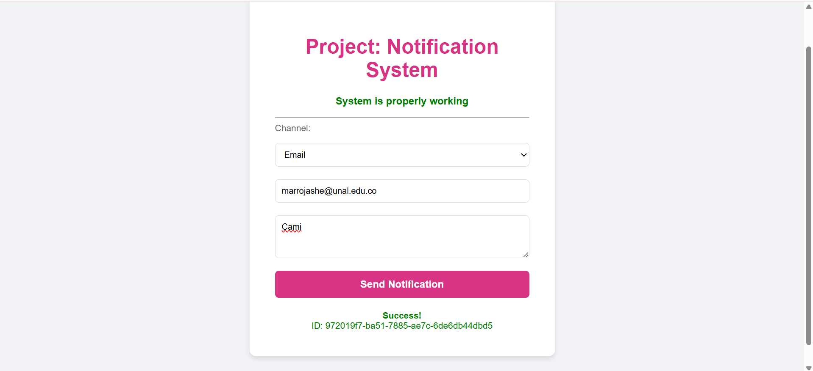

# Capa 1: Ingestión y Producción (API Gateway + Lambda)

Esta capa expone la **Interfaz Pública** del Sistema de Notificaciones. Actúa como un desacoplador entre el cliente externo y la lógica de procesamiento.

## Componentes

### 1. Amazon API Gateway (HTTP API)
* **Endpoint Público:** `https://[ID_API].execute-api.us-east-2.amazonaws.com`
* **Rutas:**
    * `GET / (Web Tester)`: Despliega una interfaz gráfica interactiva (SPA) embebida en la Lambda. Permite enviar notificaciones de prueba a cualquiera de los 3 canales directamente desde el navegador, sin necesidad de herramientas externas como Postman.
    * `POST /send`: Endpoint REST para envío programático de notificaciones.

### 2. Lambda Producer (`ProducerLambda`)
* **Función:** Recibe la petición HTTP, valida el payload y transforma los datos al esquema de evento estándar `com.proyecto.notificaciones`.
* **Integración:** Publica el evento en **Amazon EventBridge** (Bus `default`).

## Contrato de API (Uso)

### Enviar Notificación (POST)

**URL:** `POST /send`

**Body (JSON):**
```json
{
  "channel": "EMAIL | SMS | PUSH",
  "to": "destinatario@ejemplo.com",
  "msg": "Contenido del mensaje",
  "subject": "Asunto (Opcional, solo para Email)"
}

### Interfaz de Pruebas Web
Al acceder a la URL raíz del API Gateway, se carga el cliente web ligero:

