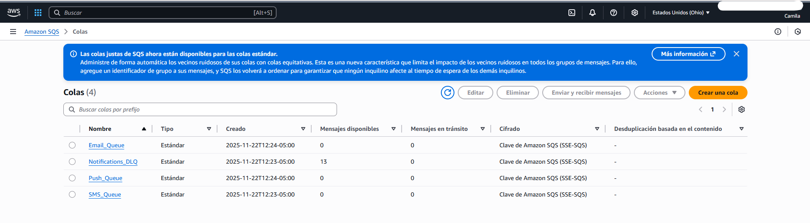
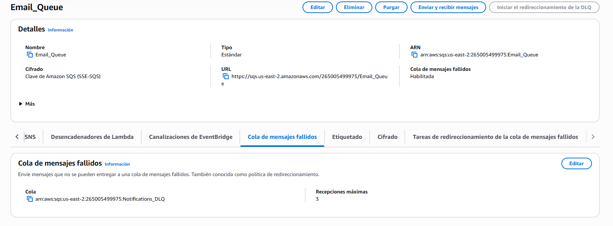
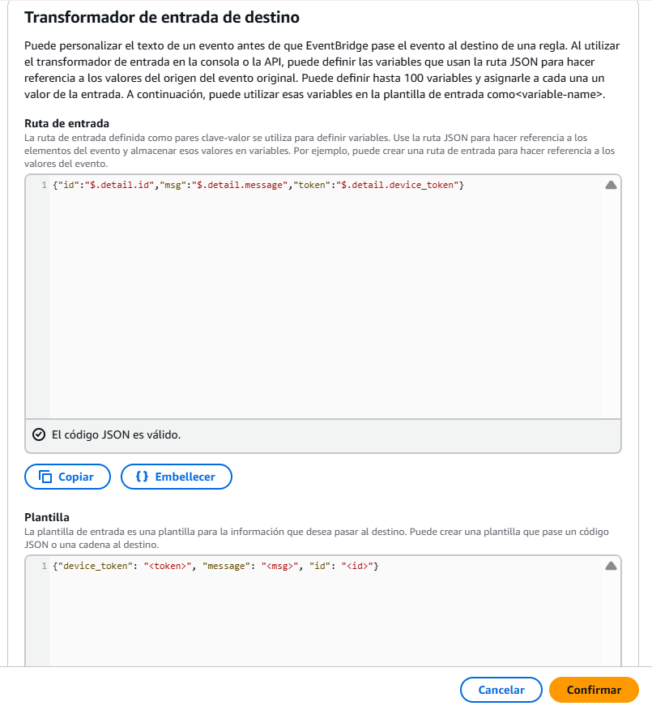

# Capa 2: Enrutamiento y Buffer

Esta capa es el núcleo de la arquitectura "Event-Driven". Desacopla la ingestión (Capa 1) del procesamiento (Capa 3), garantizando que el sistema pueda escalar y manejar fallos sin perder datos.

## Arquitectura de Enrutamiento

### 1. Amazon EventBridge (Router)
Utilizamos un modelo de **Filtrado de Contenido**. EventBridge inspecciona el campo `detail.type` de cada evento entrante y lo dirige al canal apropiado.
* **Transformación:** Se aplica un *Input Transformer* en cada regla para sanitizar el JSON, eliminando la envoltura del evento de AWS y entregando solo la carga útil limpia a la cola.

### 2. Amazon SQS (Buffer)
Se implementó el patrón **Queue-Based Load Leveling**. Cada canal tiene su propia cola, lo que permite que los consumidores procesen los mensajes a su propio ritmo.

| Canal | Cola | Configuración de Seguridad |
| :--- | :--- | :--- |
| **EMAIL** | `Email_Queue` | SSE-SQS (Encriptado) |
| **SMS** | `SMSQueue` | SSE-SQS (Encriptado) |
| **PUSH** | `PushQueue` | SSE-SQS (Encriptado) |

### 3. Resiliencia y Manejo de Errores (DLQ)
Se implementó una **Dead Letter Queue (DLQ)** centralizada llamada `NotificacionesDLQ`.
* **Política de Redrive:** Si un consumidor (Lambda) falla 3 veces al procesar un mensaje, SQS mueve el mensaje automáticamente a la DLQ.
* **Caso de Uso:** Durante el desarrollo, la DLQ fue crucial para detectar errores de formato JSON en la integración EventBridge-SQS.

## Evidencias de Configuración

### Reglas de Enrutamiento Activas

### Colas y Configuración DLQ

### Detalle de Transformación (JSON)

